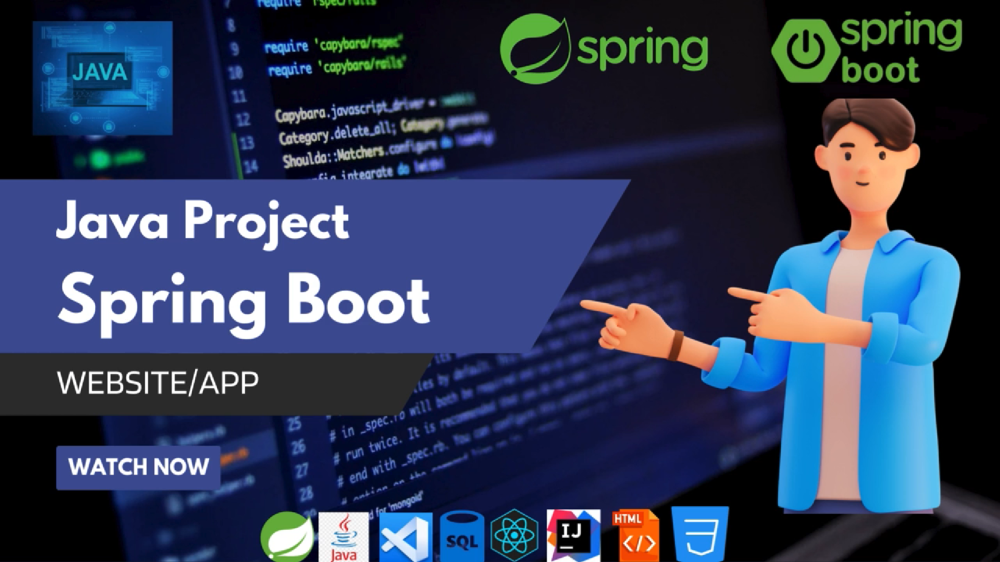

# Spring Boot - Java Framework

#### 🔷 What exactly is going on here?
Spring is widely used for creating scalable applications. For web applications Spring provides Spring MVC which is a widely used module of spring which is used to create scalable web applications. But main
disadvantage of spring projects is that configuration is really time-consuming and can be a bit overwhelming for the new developers.
Making the application production-ready takes some time if you are new to the spring. Solution to this is

Spring Boot
. Spring Boot is built on the top of the spring and contains all the features of spring. And is becoming favourite of developer’s these days because of it’s a rapid production-ready environment which enables the developers to directly focus on the logic instead of struggling with the configuration and set up. Spring Boot is a microservice-based framework and making a production-ready application in it takes very less time. Prerequisite for Spring Boot is the basic knowledge Spring framework. For revising the concepts of spring framework
***

Building a Flourishing Business Website: My Spring Boot & React.js Project

Excited to share a project I've been working on: a website for Bilal Flour and General Mill! 

This project leverages the power of modern web development techniques:

♐ Frontend:
- HTML & CSS:  Building a clean and responsive user interface.
- Node.js & React.js: Utilizing a single-page application for a seamless user experience.

♎ Backend:
- Java & Spring Boot:  A robust and scalable foundation for backend services.
- H2 Database & Oracle: Flexible data management options depending on deployment needs.
- Spring & Spring Boot: Streamlining development with proven frameworks.

♀️ Development Tools:
- VS Code/IntelliJ: Efficient coding environments.
- Postman: API testing and development.
- Thunder Client: Another powerful API testing tool (optional).

See it in Action!

Get a sneak peek of the website in action through this YouTube video: [ https://youtu.be/RHaKwZuBM-o?si=YorNgI8Y0ZXsbOD8 ]

#spring #springBoot #reactjs #nodejs #java #webdevelopment #website #bilalflour #generalmill

<h3 align="center">💣 Support this repository 💣</h3>
 

- By giving this repository a star(⭐️), you made it more visible
- Be sure to send this repository to your friends who are interested in this area
- Follow the gray cube team on other platforms

***
### Writer : Muhammad Bilal Ashiq 

 

  
  
    
    
  

